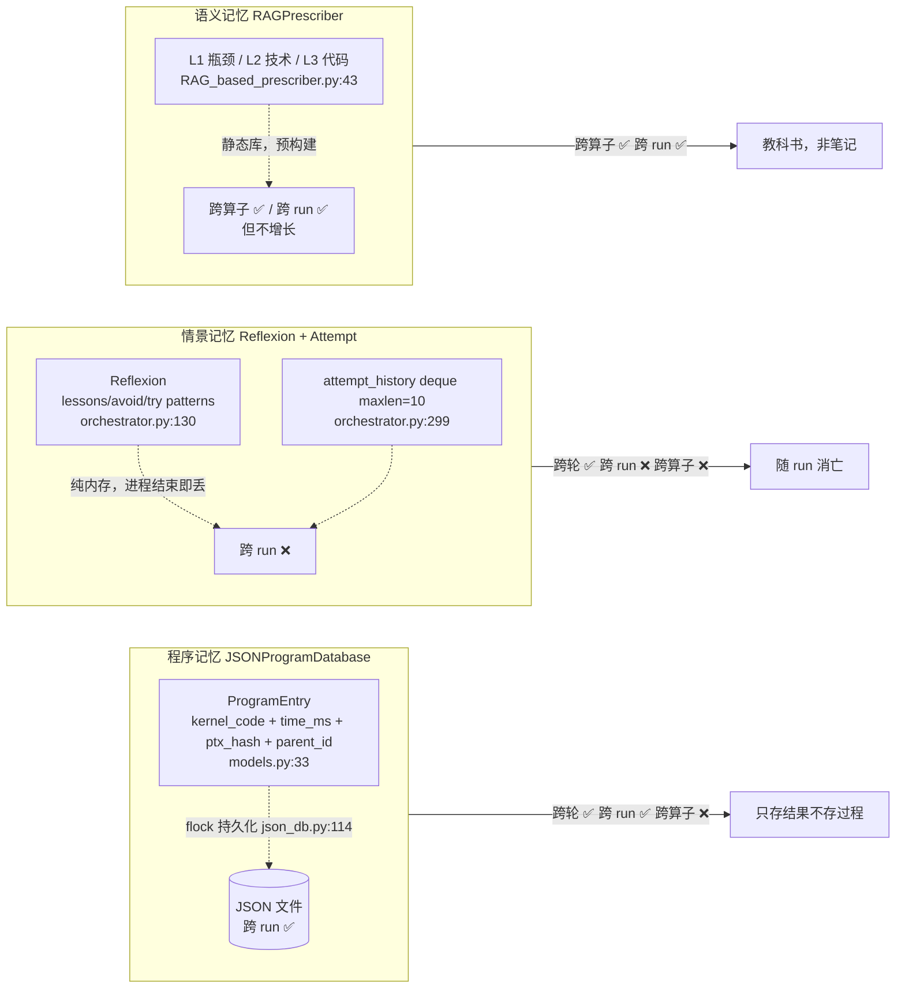
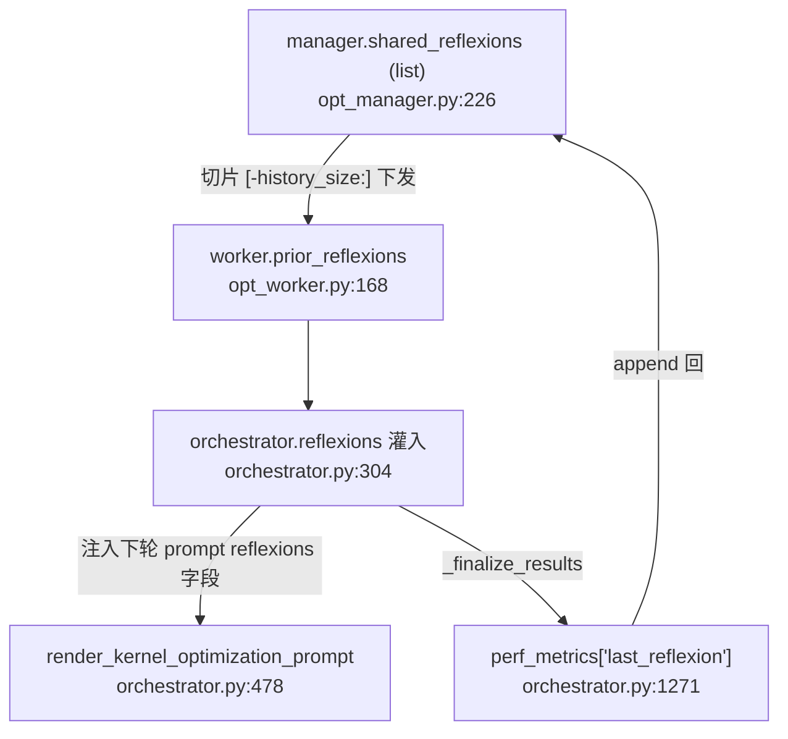

# KernelAgent 记忆系统分析

> 基于真实代码梳理，分析 KernelAgent 记忆系统的分层结构、持久化边界、设计取舍与缺陷。所有结论附 `file:line`。
>
> 写于 2026-07-26。结构与运行过程见 `docs/KernelAgent详细结构与运行过程.md`；本文聚焦"记忆"这一维。

---

## 一、核心洞察：三层记忆，边界不对称

按认知科学"程序/情景/语义"三分法对应到代码，KernelAgent 有三层记忆，**但三层的持久化边界完全不同**——这是理解它记忆系统的钥匙，也是最反直觉的设计。

| 记忆层 | 代码对应 | 存什么 | 跨轮 | 跨 run | 跨算子 |
|---|---|---|---|---|---|
| **程序记忆** | `JSONProgramDatabase` + `ProgramEntry`（`models.py:33`） | kernel 代码 + time_ms + ptx_hash + parent_id | ✅ | ✅ **持久化**（`flock`，`json_db.py:114`） | ❌（按 problem_id） |
| **情景记忆** | `OptimizationAttempt` + `Reflexion`（`orchestrator.py:70,130`） | 每轮尝试 + 反思教训 | ✅ | ❌ **纯内存丢** | ❌ |
| **语义记忆** | `RAGPrescriber` 层级知识库（`RAG_based_prescriber.py:43`） | L1 瓶颈 / L2 技术 / L3 代码示例 | — | ✅（库静态） | ✅ **跨算子** |

**不对称的后果**：重启后，KernelAgent 记得"哪些 kernel 快"（程序记忆在盘上），但**忘了"上次为什么失败、学到什么教训"**（情景记忆丢了），却仍能查"这类瓶颈一般怎么修"（语义记忆是静态库）。

---

## 二、程序记忆：唯一跨 run 的，但只存"结果"不存"过程"

`ProgramEntry`（`models.py:33`）字段：`kernel_code / metrics(time_ms) / ptx_hash / parent_id / generation`。

- **持久化**：单 JSON 文件 + `fcntl.flock(LOCK_EX)`（`json_db.py:114`），多 worker 并发写安全。
- **跨 run**：`OptimizationManager.__init__` 若 `database_path` 存在则 `load()`（`opt_manager.py:177`）——接着上次跑能续上，从历史 best 继续优化。
- **去重靠 ptx_hash**：归一化 PTX 指纹，相同 PTX 取最快者（`models.py:45`）。程序记忆的"去重记忆"——不重复存等价 kernel。
- **关键限制**：只存"结果"（kernel + 时间），**不存"怎么来的"**（父本的失败原因、变异思路）。重启续跑能继承 best kernel，但**继承不了"为什么之前那些尝试不行"**——那部分在情景记忆里，而情景记忆不跨 run。

读写分工有句注释点睛："Only the main optimization loop should write；workers return via queue"（`store.py:26`）——worker 不直接写盘，经 queue 回主循环统一写，避多进程并发写盘竞态。

---

## 三、情景记忆：reflexion 跨轮传递，跨 run 丢失（最大取舍）

这是记忆系统里**最值得分析**的一层。

### 生成 `_generate_reflexion`（`orchestrator.py:974`）

- attempt **没通过验证** → 直接构造 fallback Reflexion（无 LLM，记录"验证失败"）
- attempt **通过验证** → `render_reflexion_prompt` → LLM → 解析 JSON，字段含 `was_diagnosis_correct / was_fix_effective / expected / actual / reasoning / lessons / avoid_patterns / try_patterns`（`prompt_manager.py:349`）

这是"自我反思"——让 LLM 回看"我上轮判断对了吗、实际怎样、学到什么、下次该避免/尝试什么"。

### 跨轮传递路径（情景记忆活的地方）

### 关键缺陷

`shared_reflexions` / `attempt_history` / `reflexions` **全是内存对象，进程结束即丢**（`opt_manager.py:226`、`orchestrator.py:299`）。reflexion 虽存了 `.txt`（`orchestrator.py:1011`）但**从不回读**。所以：
- **跨轮**：✅ 同一次 run 内，教训逐轮积累，越跑越聪明
- **跨 run**：❌ 新 run 从零起步，忘了上次所有教训

> 这像是"写了日记但从不翻"——文件已落盘，只差回读逻辑。

---

## 四、语义记忆：RAG 层级知识库，唯一跨算子的

`RAGPrescriber`（`RAG_based_prescriber.py:43`）：
- **三层知识库**：L1 瓶颈类型 / L2 优化技术 / L3 代码示例，来源硬编码 `kernel_perf_agent/kernel_opt/database/code_samples`（`:79`）
- **检索**：用 OpenAI `text-embedding-3-large` 对 query 嵌入，cosine 取最近（`:131`）。query 由当轮瓶颈构造 `"{category}: {summary} {fix}"`（`orchestrator.py:449`）
- **build_context**：BFS 遍历子树，非叶给技术描述、叶给代码示例（默认 max 2、8192 字符截断，`:193`）
- **注入**：`rag_context` 字段进 optimization prompt（`prompt_manager.py:257`）

**唯一跨算子复用的记忆**——知识库按瓶颈类型组织，不按 problem_id 过滤，所以 voxelization 的"atomic-bound scatter 优化技术"能被 BEV 检索到。但**知识库静态、不随运行增长**——它不是"运行中学到的语义记忆"，是"预置的教科书"。

---

## 五、瓶颈分析：不是记忆，是每轮重算的瞬时分析

`BottleneckAnalyzer.analyze`（`bottleneck_analyzer.py:84`）每轮重新 `build_bottleneck_prompt` + LLM 调用，产 `category / root_causes / recommended_fixes`。**无缓存、无持久化**——别误把它当记忆。它是"当下的诊断"，喂进当轮 prompt 后就弃。

> 唯一缓存的是 `_baseline_profile_cache`（`opt_manager.py:235`）——但它缓存 NCU/roofline **原始指标**，不是瓶颈结论。

---

## 六、记忆注入 prompt：六类信息混合

`render_kernel_optimization_prompt`（`prompt_manager.py:241`）收的记忆类参数，来源与时效各异：

| prompt 字段 | 来源 | 记忆类型 | 时效 |
|---|---|---|---|
| `recent_attempts` | `attempt_history[-5]` | 情景 | 跨轮 |
| `reflexions` | `reflexions[-5]` | 情景 | 跨轮 |
| `rag_context` | RAG retrieve | 语义 | 静态/跨算子 |
| `category/summary/root_cause/fix` | bottleneck_analyze 当轮 | 瞬时 | 单轮 |
| `roofline` | 当轮 roofline | 指标 | 单轮 |
| `error_feedback` | 上轮失败错误 | 短时 | 1 步 |

**截断设计（有意的遗忘）**：`attempt_history` deque maxlen=10（`orchestrator.py:299`），注入 prompt 只取最近 5（`history_size`），manager 下发 worker 取最近 10。`reflexions` list 无 maxlen，只在注入时 `[-5:]` 截断。即"记得最近 5-10 轮教训，更早的忘"——防 prompt 爆炸。

---

## 七、评价：长板与短板

### 长板
1. **程序记忆跨 run**——能续跑，best kernel 不丢，工程上最实用。
2. **情景记忆跨轮积累**——同 run 内 reflexion 逐轮喂养，LLM 越跑越懂这个算子。
3. **语义记忆跨算子**——RAG 知识库让一个算子的瓶颈处方能帮另一个。
4. **PTX 去重**——程序记忆不存等价重复，省算力。

### 短板（按严重度）
1. **❗ 情景记忆跨 run 丢失**——最大短板。每次新 run 从零学教训，**不积累跨 run 经验**。reflexion 存了 .txt 却不回读，像"写了日记从不翻"。对比程序记忆能跨 run，这个不对称很扎眼。
2. **语义记忆不增长**——RAG 库静态，运行中学到的"voxelization 该用 2D 向量化 atomic"这类**新知识不进库**。只有"预置教科书"，没有"运行时笔记"。
3. **情景记忆不跨算子**——voxelization 学的教训帮不到 BEV（RAG 能，但 RAG 静态）。reflexion 按 beam 的 parent 链传，不跨 problem。
4. **AttemptRecord 结构闲置**——`records.py:22` 定义了但主流程没用，情景记忆实际走 `OptimizationAttempt.asdict`，留了套没接的结构（技术债）。

---

## 八、对改进的启示

本次分析印证 `docs/KernelAgent改进路线图.md` 几条，并补一条新发现：

- **P3-3 reflexion 跨算子迁移**——对应短板 3。若 reflexion 能跨算子，voxelization 学的"2D 向量化 atomic"会自动成 BEV 的初始提示。
- **🆕 短板 1 是路线图未列的新发现**——建议补：**reflexion 持久化 + 回读**。文件已写（`orchestrator.py:1011` 存 .txt），只差 load 逻辑。低成本高收益：加个 load 让跨 run 也积累教训。
- **短板 2 指向**：**运行时学到的优化技术回写 RAG 库**，把"教科书式 RAG"升级为"会成长的 RAG"。

---

## 附：与结构文档的关系

- **结构在哪**：`docs/KernelAgent详细结构与运行过程.md` 第八节（搜索/去重/reflexion）讲记忆的代码位置；本文讲记忆的**设计好坏**。
- **改进落地**：`docs/KernelAgent改进路线图.md` P3-3 + 本文第八节 🆕 条。
