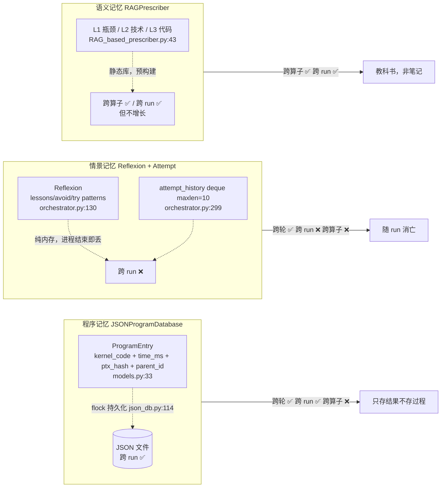

# KernelAgent 记忆系统分析

> 基于真实代码梳理，分析 KernelAgent 记忆系统的分层结构、持久化边界、设计取舍与缺陷。所有结论附 `file:line`。
>
> 写于 2026-07-26。结构与运行过程见 `docs/KernelAgent详细结构与运行过程.md`；本文聚焦"记忆"这一维。

---

## 一、核心洞察：三层记忆，边界不对称

按认知科学"程序/情景/语义"三分法对应到代码，KernelAgent 有三层记忆，**但三层的持久化边界完全不同**——这是理解它记忆系统的钥匙，也是最反直觉的设计。



| 记忆层 | 代码对应 | 存什么 | 跨轮 | 跨 run | 跨算子 |
|---|---|---|---|---|---|
| **程序记忆** | `JSONProgramDatabase` + `ProgramEntry`（`models.py:33`） | kernel 代码 + time_ms + ptx_hash + parent_id | ✅ | ✅ **持久化**（`flock`，`json_db.py:114`） | ❌（按 problem_id） |
| **情景记忆** | `OptimizationAttempt` + `Reflexion`（`orchestrator.py:70,130`） | 每轮尝试 + 反思教训 | ✅ | ❌ **纯内存丢** | ❌ |
| **语义记忆** | `RAGPrescriber` 层级知识库（`RAG_based_prescriber.py:43`） | L1 瓶颈 / L2 技术 / L3 代码示例 | — | ✅（库静态） | ✅ **跨算子** |

**不对称的后果**：重启后，KernelAgent 记得"哪些 kernel 快"（程序记忆在盘上），但**忘了"上次为什么失败、学到什么教训"**（情景记忆丢了），却仍能查"这类瓶颈一般怎么修"（语义记忆是静态库）。

---

## 二、程序记忆：唯一跨 run 的，但只存"结果"不存"过程"

### 存什么 —— `ProgramEntry`（`models.py:32-51`）

```python
# triton_kernel_agent/opt_worker_component/searching/history/models.py:32
@dataclass
class ProgramEntry:
    program_id: str
    kernel_code: str
    metrics: ProgramMetrics            # 含 time_ms

    # Lineage —— 血缘，但只记"父是谁"，不记"父为何失败"
    problem_id: str
    parent_id: str | None = None
    generation: int = 0

    # 归一化 PTX 指纹，去重用；PTX 抓取失败时为 None（按单例不合并）
    ptx_hash: str | None = None
    created_at: datetime = field(default_factory=datetime.now)
```

**读这个 dataclass 就懂了**：只存 kernel 代码 + 时间 + 血缘 id + ptx 指纹。**没有 `failure_reason` / `mutation_strategy` 字段**——只记"结果"不记"怎么来的"。这就是"重启能继承 best kernel，但继承不了'之前那些尝试为什么不行'"的代码根因。

### 怎么跨 run —— `flock` 持久化（`json_db.py:108-129`）

```python
# triton_kernel_agent/opt_worker_component/searching/history/json_db.py:108
def save(self) -> None:
    """Save to JSON with file locking."""
    self.path.parent.mkdir(parents=True, exist_ok=True)
    data = {"programs": [self._entry_to_dict(p) for p in self.programs.values()]}
    with open(self.path, "w") as f:
        fcntl.flock(f.fileno(), fcntl.LOCK_EX)     # 排他锁——多 worker 并发写安全
        json.dump(data, f, indent=2, default=str)
        fcntl.flock(f.fileno(), fcntl.LOCK_UN)

def load(self) -> None:                             # 启动时调，跨 run 续跑的入口
    if not self.path.exists():
        return
    with open(self.path, "r") as f:
        data = json.load(f)
    for prog_dict in data.get("programs", []):
        entry = self._dict_to_entry(prog_dict)
        self.programs[entry.program_id] = entry
```

`flock(LOCK_EX)` 是程序记忆能跨 run 的关键——文件锁保证多 worker 并发写不撕裂。`OptimizationManager.__init__` 若 `database_path` 存在则 `load()`（`opt_manager.py:177`），所以接着上次跑能续上。

### 谁写谁读 —— 注释点睛（`store.py:26`）

```python
# triton_kernel_agent/opt_worker_component/searching/history/store.py:26
# "Only the main optimization loop should write to the store;
#  workers return via queue"
```

worker 不直接写盘，经 queue 回主循环统一 `add_program`。避多进程并发写盘竞态——这是程序记忆并发安全的制度保障。

---

## 三、情景记忆：reflexion 跨轮传递，跨 run 丢失（最大取舍）

这是记忆系统里**最值得分析**的一层。

### 生成 `_generate_reflexion`（`orchestrator.py:964-991`）

```python
# triton_kernel_agent/opt_worker_component/orchestrator/optimization_orchestrator.py:964
def _generate_reflexion(self, attempt: OptimizationAttempt) -> Reflexion | None:
    if not attempt.passed_verification:
        # 没通过验证 → 不调 LLM，直接构造失败反思
        return Reflexion(
            ...,
            was_diagnosis_correct=False,
            was_fix_effective=False,
            reasoning=f"Attempt failed verification: {attempt.error_message[:200] ...}",
            lessons=["Ensure generated code passes correctness checks"],
            avoid_patterns=[f"Similar approach to round {attempt.round_num} that failed verification"],
            try_patterns=[],
        )
    # 通过验证 → 调 LLM 做真反思
    reflexion_prompt = self.prompt_manager.render_reflexion_prompt(attempt)   # :995
```

两种路径：失败的 attempt 廉价记一句"别再这么干"；成功的 attempt 让 LLM 回看"我上轮判断对吗、实际怎样、学到什么、该避免/尝试什么"——reflexion prompt 模板字段 `was_diagnosis_correct / was_fix_effective / expected / actual / reasoning / lessons / avoid_patterns / try_patterns`（`prompt_manager.py:349`）。这就是"自我反思"的代码形态。

### 存哪 —— 纯内存 deque/list（`orchestrator.py:298-309`）

```python
# triton_kernel_agent/opt_worker_component/orchestrator/optimization_orchestrator.py:298
# History tracking for reflexion
self.attempt_history: deque[OptimizationAttempt] = deque(maxlen=10)   # 上限 10
self.reflexions: list[Reflexion] = []                                    # 无上限
self.history_size: int = 5                                               # 注入 prompt 只取 5

# Initialize from prior history if provided (shared from beam search manager)
if prior_history:                              # ← 跨轮灌入的入口
    for attempt_dict in prior_history:
        self.attempt_history.append(OptimizationAttempt.from_dict(attempt_dict))
if prior_reflexions:
    for reflexion_dict in prior_reflexions:
        self.reflexions.append(Reflexion.from_dict(reflexion_dict))
```

**看这两个数据结构就知道边界**：`deque(maxlen=10)` 和 `list` 都是**内存对象**，进程结束即丢。`prior_history`/`prior_reflexions` 是从 manager 灌进来的——这就是跨轮传递的接收端。注意 `deque(maxlen=10)`：超过 10 条自动丢最老的，这是"有意的遗忘"。

### 跨轮传递路径（`opt_manager.py:590-604`）

```python
# triton_kernel_agent/opt_manager.py:590
shared_history=(
    self.shared_history[-self.history_size :] if self.shared_history else []    # 只下发最近 N 条
),
shared_reflexions=(
    self.shared_reflexions[-self.history_size :]
    if self.shared_reflexions
    else []
),
# ... 跑 worker ...

# Collect history and reflexions from worker results       # opt_manager.py:600
for r in results:
    if r.get("attempt"):
        self.shared_history.append(r["attempt"])           # 回流：worker 的产出 append 回 manager
    if r.get("reflexion"):
        ...
```

完整环路：manager `shared_reflexions` 切片下发 → worker `prior_reflexions` → orchestrator 灌入 `reflexions` → 注入下轮 prompt → 回流 append。**但 `shared_reflexions` 自身也是内存 list**（`opt_manager.py:226`）——整条链路都在内存，所以**跨 run 全丢**。

### 注入下轮 prompt（`orchestrator.py:478-481`）

```python
# triton_kernel_agent/opt_worker_component/orchestrator/optimization_orchestrator.py:474
render_kernel_optimization_prompt(
    ...,
    recent_attempts=recent_attempts if recent_attempts else None,
    reflexions=self.reflexions[-self.history_size :]        # 只取最近 5 条注入
    if self.reflexions
    else None,
    rag_context=rag_context,
)
```

reflexion 就这样喂回 LLM——"上次学到什么"成了下轮 prompt 的一部分。

### 关键缺陷

reflexion 虽存了 `.txt`（`orchestrator.py:1011`）但**从不回读**（代码里搜不到 load reflexion 的逻辑）。所以：
- **跨轮**：✅ 同一次 run 内，教训逐轮积累，越跑越聪明
- **跨 run**：❌ 新 run 从零起步，忘了上次所有教训

> 像是"写了日记但从不翻"——文件已落盘，只差回读逻辑。这正是第八节那条改进建议的落点。

---

## 四、语义记忆：RAG 层级知识库，唯一跨算子的

`RAGPrescriber`（`RAG_based_prescriber.py:43`）维护一棵**三层知识树**：L1 瓶颈类型 / L2 优化技术 / L3 代码示例，来源硬编码 `kernel_perf_agent/kernel_opt/database/code_samples`（`:79`）。检索时按当轮瓶颈查这棵树，取最相似节点及其子树作为上下文。

### 检索 —— embedding cosine（`RAG_based_prescriber.py:168-184`）

```python
# triton_kernel_agent/opt_worker_component/prescribing/RAG_based_prescriber.py:168
key_embedding = self._embed_query(opt_prompt)        # OpenAI text-embedding-3-large

# Compute similarity against precomputed L1/L2 node embeddings
opt_similarity: dict[OptNode, float] = {}
for node, node_embedding in self._node_embeddings.items():
    opt_similarity[node] = self._cosine_similarity(key_embedding, node_embedding)

# Get node with highest similarity
opt_similarity_sorted = sorted(opt_similarity.items(), key=lambda item: item[1], reverse=True)
best_node = opt_similarity_sorted[0][0]             # 取最相似的节点
```

query 由当轮瓶颈构造 `"{category}: {summary} {fix}"`（`orchestrator.py:449`）。**注意 `_node_embeddings` 是预计算的**——知识库静态，检索时只算 query embedding。这就是"教科书"的代码形态：内容固定，只是按需翻页。

### 注入 —— `rag_context` 进 prompt（`orchestrator.py:481`）

`build_context` BFS 遍历 best_node 子树，非叶给技术描述、叶给代码示例（默认 max 2、8192 字符截断，`:193`），产出的 `rag_context` 经 `render_kernel_optimization_prompt(rag_context=...)`（`prompt_manager.py:257`）注入。

**唯一跨算子复用的记忆**——知识库按瓶颈类型组织，不按 problem_id 过滤，所以 voxelization 的"atomic-bound scatter 优化技术"能被 BEV 检索到。但**库静态、不随运行增长**——它不是"运行中学到的语义记忆"，是"预置的教科书"。

---

## 五、瓶颈分析：不是记忆，是每轮重算的瞬时分析

`BottleneckAnalyzer.analyze`（`bottleneck_analyzer.py:84`）每轮重新 `build_bottleneck_prompt` + LLM 调用，产 `category / root_causes / recommended_fixes`。**无缓存、无持久化**——别误把它当记忆。它是"当下的诊断"，喂进当轮 prompt 后就弃。

> 唯一缓存的是 `_baseline_profile_cache`（`opt_manager.py:235`）——但它缓存 NCU/roofline **原始指标**，不是瓶颈结论。

---

## 六、记忆注入 prompt：六类信息混合

`render_kernel_optimization_prompt`（`prompt_manager.py:241`）收的记忆类参数，来源与时效各异：

| prompt 字段 | 来源 | 记忆类型 | 时效 |
|---|---|---|---|
| `recent_attempts` | `attempt_history[-5]` | 情景 | 跨轮 |
| `reflexions` | `reflexions[-5]` | 情景 | 跨轮 |
| `rag_context` | RAG retrieve | 语义 | 静态/跨算子 |
| `category/summary/root_cause/fix` | bottleneck_analyze 当轮 | 瞬时 | 单轮 |
| `roofline` | 当轮 roofline | 指标 | 单轮 |
| `error_feedback` | 上轮失败错误 | 短时 | 1 步 |

**截断设计（有意的遗忘）**：`attempt_history` deque maxlen=10（`orchestrator.py:299`），注入 prompt 只取最近 5（`history_size`），manager 下发 worker 取最近 10。`reflexions` list 无 maxlen，只在注入时 `[-5:]` 截断。即"记得最近 5-10 轮教训，更早的忘"——防 prompt 爆炸。

---

## 七、评价：长板与短板

### 长板
1. **程序记忆跨 run**——能续跑，best kernel 不丢，工程上最实用。
2. **情景记忆跨轮积累**——同 run 内 reflexion 逐轮喂养，LLM 越跑越懂这个算子。
3. **语义记忆跨算子**——RAG 知识库让一个算子的瓶颈处方能帮另一个。
4. **PTX 去重**——程序记忆不存等价重复，省算力。

### 短板（按严重度）
1. **❗ 情景记忆跨 run 丢失**——最大短板。每次新 run 从零学教训，**不积累跨 run 经验**。reflexion 存了 .txt 却不回读，像"写了日记从不翻"。对比程序记忆能跨 run，这个不对称很扎眼。
2. **语义记忆不增长**——RAG 库静态，运行中学到的"voxelization 该用 2D 向量化 atomic"这类**新知识不进库**。只有"预置教科书"，没有"运行时笔记"。
3. **情景记忆不跨算子**——voxelization 学的教训帮不到 BEV（RAG 能，但 RAG 静态）。reflexion 按 beam 的 parent 链传，不跨 problem。
4. **AttemptRecord 结构闲置**——`records.py:22` 定义了但主流程没用，情景记忆实际走 `OptimizationAttempt.asdict`，留了套没接的结构（技术债）。

---

## 八、对改进的启示

本次分析印证 `docs/KernelAgent改进路线图.md` 几条，并补一条新发现：

- **P3-3 reflexion 跨算子迁移**——对应短板 3。若 reflexion 能跨算子，voxelization 学的"2D 向量化 atomic"会自动成 BEV 的初始提示。
- **🆕 短板 1 是路线图未列的新发现**——建议补：**reflexion 持久化 + 回读**。文件已写（`orchestrator.py:1011` 存 .txt），只差 load 逻辑。低成本高收益：加个 load 让跨 run 也积累教训。
- **短板 2 指向**：**运行时学到的优化技术回写 RAG 库**，把"教科书式 RAG"升级为"会成长的 RAG"。

---

## 附：与结构文档的关系

- **结构在哪**：`docs/KernelAgent详细结构与运行过程.md` 第八节（搜索/去重/reflexion）讲记忆的代码位置；本文讲记忆的**设计好坏**。
- **改进落地**：`docs/KernelAgent改进路线图.md` P3-3 + 本文第八节 🆕 条。
