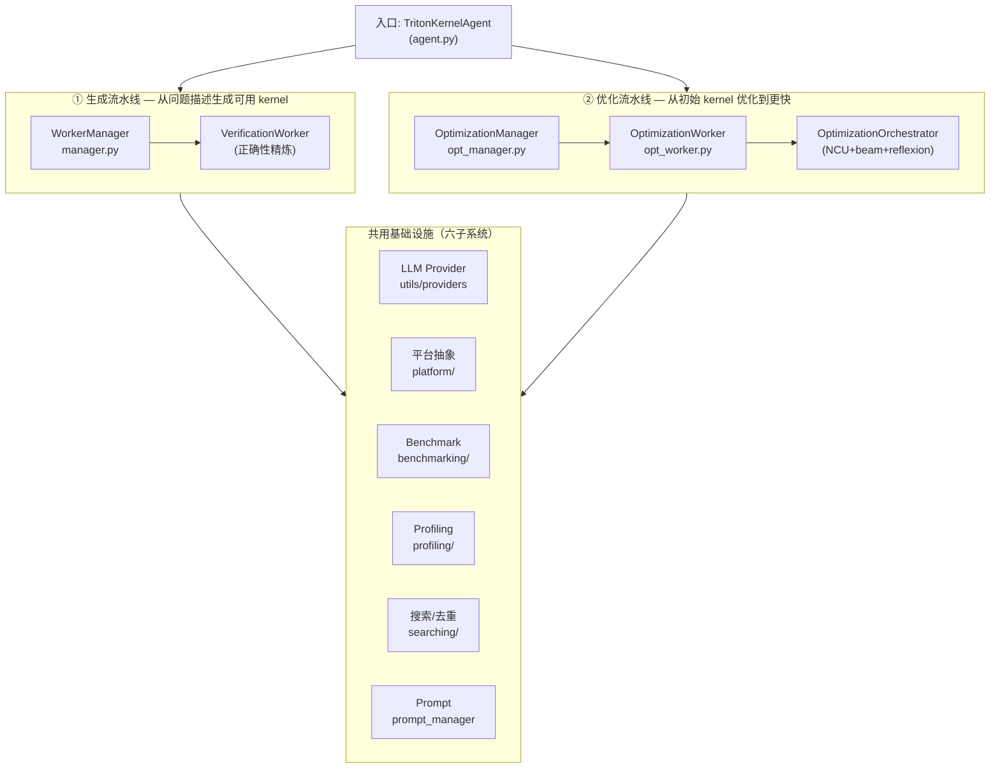
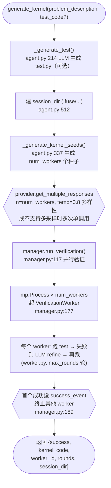
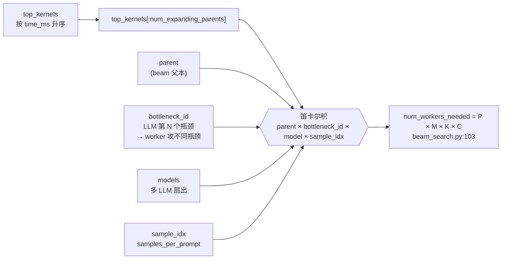
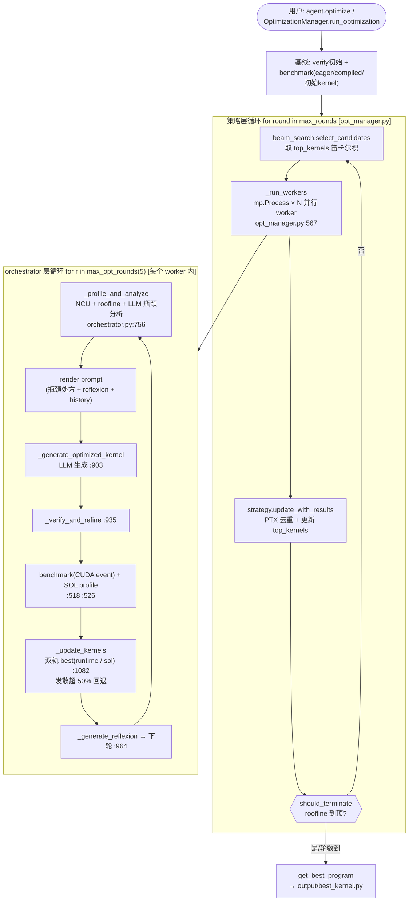

# KernelAgent 详细结构与运行过程

> 本文基于真实代码梳理，描述 KernelAgent 当前的模块结构、数据流、调用关系与一次优化的完整运行过程。所有结论附 `file:line` 定位，便于核对源码。
>
> 写于 2026-07-25。代码以本工程 `triton_kernel_agent/` 为准。

---

## 一、全局架构：两条流水线 + 六个子系统

KernelAgent 把"PyTorch 程序 → 优化 Triton kernel"拆成**两条独立流水线**，共用一套基础设施。



**两条流水线互不调用**：
- ① `manager.py`（`WorkerManager`）：正确性验证/精炼，"生成种子 → 跑测 → 过"，首个成功即止。
- ② `opt_manager.py`（`OptimizationManager`）：性能优化，多轮 beam search + NCU 瓶颈分析 + reflexion。

> 注：我们这次跑 voxelization/BEV 用的 `examples/optimize_kernel_remote.py` 是**绕过两条流水线的简化闭环**（直接 LLM + daemon），见第十节。

---

## 二、代码结构地图

```
triton_kernel_agent/
├── agent.py                  # 用户入口 TritonKernelAgent
├── manager.py                # ① 生成流水线 WorkerManager
├── opt_manager.py            # ② 优化流水线 OptimizationManager
├── worker.py                 # ① VerificationWorker
├── opt_worker.py             # ② OptimizationWorker（组件装配层）
├── worker_util.py            # 子进程跑 test 的工具
├── prompt_manager.py         # Jinja2 prompt 模板管理
├── platform_config.py        # 平台配置解析
├── platform/
│   ├── registry.py           # (component, impl) → factory
│   ├── interfaces.py         # Verifier/Benchmarker/Profiler 接口
│   ├── nvidia.py             # 本地 NVIDIA 实现
│   ├── remote.py             # 远程 daemon 实现 + RemoteVerificationWorker
│   └── noop.py               # 空实现（测试用）
├── remote/
│   └── deploy.py             # 全自动部署 daemon
└── opt_worker_component/
    ├── orchestrator/optimization_orchestrator.py  # 优化执行核心
    ├── benchmarking/         # benchmark.py / kernel_subprocess.py / timing.py
    ├── profiling/            # kernel_profiler.py (NCU) / ncu_wrapper_factory.py
    ├── prescribing/          # bottleneck_analyzer.py / RAG_based_prescriber.py
    └── searching/
        ├── strategy/beam_search.py   # beam search 策略
        ├── strategy/greedy.py         # 贪心策略
        ├── sampler.py                # 预留原语（未接入 beam search）
        ├── mutation/mutator.py       # 预留原语（未接入）
        ├── ptx_fingerprint.py        # PTX 归一化去重
        └── history/                  # json_db.py / store.py / models.py
utils/providers/              # LLM provider（Anthropic/OpenAI/Relay）
scripts/remote_daemon.py      # 云端 FastAPI daemon
```

> **重要**：`sampler.py` / `mutator.py` 是**预留/实验性原语**，当前默认 beam search 路径**未接入**——变异指令由 `prompt_manager` + orchestrator 内联生成，候选由 `BeamSearchStrategy` 直接从 top_kernels 选。别误以为它们在跑。

---

## 三、生成流水线：`generate_kernel` 运行过程

入口 `TritonKernelAgent.generate_kernel`（`agent.py:462`）。目标：从问题描述生成一个**能通过测试**的 kernel。



关键点：
- **种子并行**：`num_workers`（默认 4，env `NUM_KERNEL_SEEDS`）个种子同时验证，先过者胜。
- **精炼在 worker 内**：`VerificationWorker` 内部循环 refine（LLM 改 kernel → 重测），`max_rounds`（默认 10，env `MAX_REFINEMENT_ROUNDS`）轮。
- **无 agent 层 retry**：`agent.py`/provider 层无显式重试，失败即 raise（`agent.py:263`）；refine 重试在 orchestrator 层。

---

## 四、优化流水线：`run_optimization` 运行过程（核心）

入口 `OptimizationManager.run_optimization`（`opt_manager.py:397`）。目标：从初始 kernel 优化到更快。这是 KernelAgent 的**核心能力**，双层循环。

### 4.1 manager 层（策略层）循环 `opt_manager.py:467`

```
run_optimization()
  ├─ _verify_initial_kernel / _benchmark_pytorch_baseline / 
  │  _benchmark_pytorch_compile / _benchmark_initial_kernel   # opt_manager.py:544-565
  ├─ for round in max_rounds:
  │    ├─ strategy.select_candidates(round)     # 选父本（beam search）
  │    ├─ _run_workers(candidates)                # opt_manager.py:567  并行 worker
  │    │    └─ mp.Process × N 起 OptimizationWorker
  │    │       └─ worker.optimize_kernel → orchestrator.optimize_kernel
  │    ├─ strategy.update_with_results()          # 更新 top_kernels、PTX 去重
  │    └─ strategy.should_terminate()            # roofline 到顶/无提升
  └─ strategy.get_best_program()
```

### 4.2 worker 层（orchestrator）循环 `optimization_orchestrator.py:386`

每个 `OptimizationWorker` 构造一个 `OptimizationOrchestrator`（`opt_worker.py:443`）并调 `orchestrator.optimize_kernel`（`:474`）。默认 `max_opt_rounds=5`（`:317`）。每轮：

```
optimize_kernel() 每轮:
  ├─ _profile_and_analyze()        # :756  NCU profile + roofline + LLM 瓶颈分析
  │    ├─ NCU profile (orchestrator.py:785)
  │    ├─ roofline 分析 (:800)
  │    └─ bottleneck LLM 分析 (:841)  → category/summary/reasoning/root_cause/recommended_fix
  ├─ render_kernel_optimization_prompt()   # 注入瓶颈处方 + recent_attempts + reflexions + rag
  ├─ _generate_optimized_kernel()  # :903  LLM 生成
  ├─ _verify_and_refine()           # :935  验证 + LLM refine 循环
  ├─ benchmarker.benchmark_kernel() # :518  CUDA event 计时
  ├─ _profile_kernel_for_sol()      # :526  SOL profile
  ├─ _update_kernels()              # :1082 双轨更新 best
  └─ _generate_reflexion()          # :964  反思，存入下轮 prompt
```

### 4.3 双轨 best 选取（易踩的坑）

orchestrator **同时追踪两个 best**（`orchestrator.py:376-383`）：
- `best_runtime_kernel`：实测最快的
- `best_sol_kernel`：SOL（speed-of-light）最优的

`_update_kernels`（`:1082`）按 runtime 与 SOL 分别更新；两者**发散超 `divergence_threshold`（默认 50%）则回退 best**（`:1148`）——防止 LLM 为追 SOL 写出实测反而慢的 kernel。roofline `at_roofline` 触发早停（`:626`）。

### 4.4 beam search 怎么选候选 `beam_search.py:132`



**无温度/概率采样**——beam 成员按 `time_ms` 升序截断（`:220`），多样性来自"多瓶颈 × 多模型 × 多采样"的笛卡尔积，不是采样分布。

### 4.5 优化流水线总览（双层循环）



---

## 五、LLM Provider 子系统

`utils/providers/`，抽象 + 三实现。

### 5.1 抽象 `base.py`

`BaseProvider`（ABC）+ `LLMResponse` dataclass（`base.py:23`，字段 `content/model/provider/usage/response_id`）。
- `get_response(model, messages, **kwargs) -> LLMResponse`（`:46`）
- `get_multiple_responses(model, messages, n=1) -> list`（`:63`）
- 默认 `supports_multiple_completions=False`、`get_max_tokens_limit=8192`

### 5.2 三实现

| Provider | name | 特点 | 多采样 |
|---|---|---|---|
| `AnthropicProvider` | anthropic | 见下 | 手动（n 次单调用，温度递增） |
| `OpenAIProvider` | openai | 走 OpenAICompatibleProvider | 原生 n |
| `RelayProvider` | relay | 本地 plugboard 中转（默认 127.0.0.1:11434） | 原生 n |

### 5.3 AnthropicProvider（我们这次接金山云用的）

`anthropic_provider.py`：
- **两条初始化路径**（`_initialize_client` `:38`）：
  - 路径 A：有 `ANTHROPIC_API_KEY` → `Anthropic(api_key=...)`（标准）
  - 路径 B：无 API_KEY 但有 `ANTHROPIC_AUTH_TOKEN`/`ANTHROPIC_BASE_URL` → 无参 `Anthropic()`，SDK 自读 env（bearer-token 网关，如金山云 kspmas → DeepSeek-V4-Pro）
- **thinking budget**（`get_response` `:82`）：读 `ANTHROPIC_THINKING_BUDGET`，注入 `thinking={"type":"enabled","budget_tokens":b}`，且自动把 `max_tokens` 抬到 `b + max(4096,b)`（SDK 要求 max_tokens > budget）。**这是这次 voxelization 优化能产出代码的关键**（见 `docs/skills/reasoning-model-thinking-budget.md`）。
- **_extract_text**（`:95`）：遍历 `response.content` 跳过 `ThinkingBlock`（无 `.text`），取首个 `type=="text"`；**无 text block 返回 `""`**（不返回 `str(content)` 以免把思考草稿当答案）。

### 5.4 模型注册与工厂

- `AVAILABLE_MODELS`（`available_models.py:24`）中央注册表，每项 `ModelConfig(name, provider_classes, description)`。`deepseek-v4-pro` 注册在 `:30`，`provider_classes=[AnthropicProvider]`。
- `get_model_provider(model_name)`（`models.py:52`）：查注册表 → 按顺序取 provider_classes 中首个 `is_available()` 的（缓存实例）。**未知模型默认走 RelayProvider**（`:70`）。

---

## 六、平台抽象与远程 daemon

`platform/` 把"GPU 怎么跑"抽象成可切换实现，config 切换本地/远程。

### 6.1 registry `platform/registry.py`

`PlatformRegistry` 把 `(component, impl_name)` 映射到工厂：
- `create_from_config(config, **kwargs)`（`:134`）：spec 支持字符串（impl 名，用共享 kwargs）或 dict（`{"impl":"remote","url":...,"token":...}`，per-component 覆盖共享，`:171`）。
- 全局单例注册三套：`nvidia`（本地）、`noop`（测试）、`remote`（远程，只注册 verifier/benchmarker/profiler 三个 GPU 接口）。

### 6.2 接口 `platform/interfaces.py`

- `KernelVerifier.verify(kernel_code, problem_file, test_code) -> bool`（`:30`）
- `KernelBenchmarker.benchmark_kernel / benchmark_reference -> float(ms)`（`:53`，失败返 inf）
- `WorkerRunner.run_workers(...) -> list[dict]`（`:104`）
- `KernelProfilerBase.profile_kernel(...) -> Any|None`（`:176`）

### 6.3 本地 nvidia vs 远程 remote

- **nvidia**（`platform/nvidia.py`）：`NvidiaWorkerRunner.run_workers`（`:214`）用 `mp.Process` 并发 + 轮转 GPU（`gpu_id = gpu_ids[i % len]`，`:238`），同一 per-GPU lock 同时作 benchmark_lock 与 profiling_semaphore（`:251`）。
- **remote**（`platform/remote.py`）：`_RemoteClient`（`:71`）POST daemon 批量端点，Bearer token，401 即拒（`:110`）。**`RemoteVerificationWorker` 只 override `_single_verification_pass`**（`:316`）——把 (kernel_code, problem_code, test) POST `/run_test_batch`，其余 refine loop / `_call_llm` / history **全继承**本地 `VerificationWorker`。这是"远程只换 GPU 执行，本地保留 LLM 大脑"的关键设计。

### 6.4 daemon `scripts/remote_daemon.py`

FastAPI，bind `127.0.0.1`，token 鉴权（`_check_token` `:85`，Bearer 或 body token）：
- `GET /health` → `{status, gpu:{name}}`
- `GET /specs` → GPU specs
- `POST /run_test_batch` → `_run_test_multiprocess`（`worker_util.py:213`，spawn 子进程，每 test 30s 超时）
- `POST /benchmark_batch` → kind ∈ kernel/eager/compiled，`_json_safe_float` 把 inf/nan 转 None（JSON 不支持 inf）
- `POST /profile_batch` → NCU profile

### 6.5 全自动部署 `remote/deploy.py`

`deploy()`（`:315`）七步：① 预 pkill（-9 + 验证杀干净，防 token 漂移）→ ② tar 同步 repo → ③ 探测 python + `pip install -e '.[remote]'`（`--python-bin` 可覆盖，应对 triton/py3.12 ABI）→ ④ here-doc 写 token → ⑤ nohup 起 daemon → ⑥ ssh -L 隧道 → ⑦ 轮询 /health。详见 `docs/远程GPU部署.md`。

---

## 七、Benchmark 与 Profiling

### 7.1 计时 `benchmarking/timing.py`

- `time_with_cuda_events`（`:263`）：`torch.cuda.Event` 记 start/end，每 trial 前 `clear_l2_cache`（256MB tensor thrash，`:244`）。
- `time_with_triton_do_bench`（`:374`）：调 `triton.testing.do_bench`。
- 默认 `warmup=25, repeat=100`，`timing_method="cuda_event"`。

### 7.2 子进程隔离 `benchmarking/benchmark.py`

- `benchmark_kernel`（`:114`）用**子进程**跑（注释 "crash protection of buggy kernels"），独立 `TRITON_CACHE_DIR` 隔离 PTX 供指纹去重（`ptx_hash_from_cache` `:195`），超时 300s，失败返 inf。
- `benchmark_pytorch`/`_compile`（`:209/:265`）**直接 in-process**（PyTorch 稳定无需隔离）。
- `BenchmarkLockManager`（`:46`）串行化 GPU 访问。

> 这就是为什么我们这次测出"每 kernel 子进程重 import torch ~3.5s"——隔离 buggy kernel 的代价。

### 7.3 NCU profiling `profiling/kernel_profiler.py`

- `profile_kernel`（`:151`）：生成 `ncu_wrapper.py` → 信号量 acquire（NCU 需独占 GPU）→ `profile_triton_kernel(launch_skip=3, launch_count=20)`。
- `launch_skip=3` 跳过 wrapper 的 3 次 warmup。
- **2080Ti 上的坑**：`NvidiaBottleneckAnalyzer` 首次 `analyze` 若 `gpu_name` 空则抛 `ValueError`（`:598`）；2080Ti 不在 `gpu_specs` 表时 bottleneck_analyzer 崩。这是这次 NCU 返回 None 的原因（见 `docs/KernelAgent改进路线图.md` P1-2）。

---

## 八、搜索、去重与 reflexion

### 8.1 PTX 指纹去重 `searching/ptx_fingerprint.py`

`ptx_hash_from_cache(cache_dir)`（`:138`）：收集 `*.ptx` → `normalize_ptx`（剥注释/调试指令、寄存器按类重命名、标签 intern、空白折叠，`:78`）→ SHA256。同 ptx_hash 的 kernel 取最快者（`beam_search.py:237`）。**作用**：LLM 改了表面代码但生成相同 PTX 的，不重复 benchmark。

### 8.2 持久化 `searching/history/json_db.py`

`JSONProgramDatabase`：单 JSON 文件 `{"programs":[...]}`，`save` 用 `fcntl.flock` 文件锁（`:114`）。存 `ProgramEntry`（kernel_code / time_ms / ptx_hash / parent_id / generation）。

### 8.3 reflexion（不存 store）

**reflexion 走 manager 内存共享**，不入 JSONProgramDatabase：
- `OptimizationManager.shared_history/shared_reflexions`（`opt_manager.py:226`）每轮收集 worker 结果的 attempt/reflexion。
- 下轮经 `shared_history[-history_size:]` 传给 worker（`:590`）。
- worker 侧 `orchestrator.attempt_history`（deque maxlen 10）/ `reflexions`（list）（`:299`）。
- 最终每轮 reflexion 经 `perf_metrics["last_reflexion"]`（`:1271`）回传 manager。

> 即：**kernel 进磁盘，reflexion 留内存**。reflexion 跨轮复用、但不跨 run 持久化。

---

## 九、Prompt 子系统 `prompt_manager.py`

`PromptManager`（`:32`）基于 Jinja2，模板在包内 `templates/`。六类 prompt：

| 模板 | 渲染方法 | 用途 |
|---|---|---|
| `test_generation.j2` | `:146` | LLM 生成 test |
| `kernel_generation.j2` | `:166` | LLM 生成初始 kernel |
| `kernel_refinement.j2` | `:199` | 失败后 LLM refine |
| `kernel_optimization.j2` | `:241` | **优化**（参数最多：gpu_specs/roofline/category/summary/reasoning/root_cause/recommended_fix/recent_attempts/reflexions/rag_context）|
| `reflexion_prompt.j2` | `:308` | 反思（缺失 fallback 内联 JSON）|
| `triton_guidelines.j2` | `:360` | Triton 写法指南 |

仅 `kernel_optimization`/`reflexion_prompt`/`triton_guidelines` 三类可经 `template_overrides` 覆盖（`:41`）。注入 `target_platform.device_string`/`kernel_guidance`（默认 `get_platform("cuda")`）。

---

## 十、我们这次用的简化闭环（与完整流水线的关系）

这次跑 voxelization/BEV 的 `examples/optimize_kernel_remote.py` **不是**完整优化流水线，是绕过 manager/orchestrator 的简化驱动：

```
optimize_kernel_remote.py（简化闭环）
  ├─ 本机 LLM (deepseek-v4-pro + thinking budget) 生成 kernel_code
  ├─ 直接 POST daemon /run_test_batch  验证
  ├─ 直接 POST daemon /benchmark_batch  计时
  └─ 比当前 best 快就存
```

**与完整流水线的关系**：
- 复用了 **daemon + RemoteClient**（第六节）的 GPU 执行能力
- 复用了 **provider + thinking budget**（第五节）的 LLM 能力
- **没用** beam search / orchestrator / NCU profiling / reflexion / PTX 去重（第八节）

为什么用简化版：完整流水线的 `OptimizationOrchestrator` 强依赖 NCU profiling + bottleneck_analyzer，而 2080Ti 上 NCU 失效（第七节 7.3），完整路径跑不通。简化版走 benchmark-driven（只比时间），绕开了 NCU 依赖。这也是 `docs/KernelAgent改进路线图.md` P1-2 要修 NCU 的原因——修好后可直接用完整 orchestrator 跑这些算子。

---

## 十一、配置与 env 速查

| env | 作用 | 默认 | 位置 |
|---|---|---|---|
| `NUM_KERNEL_SEEDS` | 并行 worker 数 | 4 | agent.py:64 |
| `MAX_REFINEMENT_ROUNDS` | 每 worker refine 轮数 | 10 | agent.py:65 |
| `ANTHROPIC_API_KEY` | Anthropic 标准 key | — | anthropic_provider.py:43 |
| `ANTHROPIC_AUTH_TOKEN` / `ANTHROPIC_BASE_URL` | bearer-token 网关 | — | anthropic_provider.py:56 |
| `ANTHROPIC_THINKING_BUDGET` | 推理模型思考预算 | 未设=不限 | anthropic_provider.py:82 |
| `OPENAI_API_KEY` | OpenAI key | — | openai_provider.py:24 |
| `LLM_RELAY_URL` / `LLM_RELAY_TIMEOUT_S` | relay 中转 | 127.0.0.1:11434 / 600 | relay_provider.py:37 |
| `KA_DAEMON_TOKEN` | daemon token（简化驱动用） | — | optimize_kernel_remote.py |

平台 config（dict-spec）示例（本地 vs 远程切换）：
```yaml
platform:
  verifier: nvidia          # 或 {impl: remote, url: ..., token: ...}
  benchmarker: nvidia
  profiler: nvidia
  verification_worker: nvidia   # 或 remote（手动构造，不走 registry）
```

---

## 十二、一图总览运行过程（优化流水线）

优化流水线的完整运行过程见上面"4.5"的 mermaid 图：策略层 `run_optimization` 循环 + orchestrator 层 5 轮循环嵌套，基线测量 → beam 选候选 → 并行 worker → NCU+瓶颈+reflexion → 双轨 best → 早停。

简化闭环（我们这次跑 voxelization/BEV 用的 `optimize_kernel_remote.py`）跳过了"策略层 + orchestrator 层 + NCU/beam/reflexion"，只保留"LLM 生成 → daemon verify → daemon benchmark → 比 best"最外圈，原因见第十节。

---

## 附：与已有文档的关系

- **怎么装/接 LLM**：`docs/安装与环境交接.md` + `docs/skills/anthropic-compatible-gateway-integration.md`
- **怎么远程跑**：`docs/远程GPU部署.md`（对应第六节 platform/remote + daemon）
- **跑出什么**：`docs/RMSNorm优化实录.md`（简化闭环）+ `docs/具身3D算子优化实录.md`（简化闭环 + 深度对照）
- **为何强**：`docs/为何KernelAgent强于直接用LLM.md`（对应第四/七/八节的 NCU+beam+reflexion）
- **改进方向**：`docs/KernelAgent改进路线图.md`（基于本文各子系统的实测痛点）
