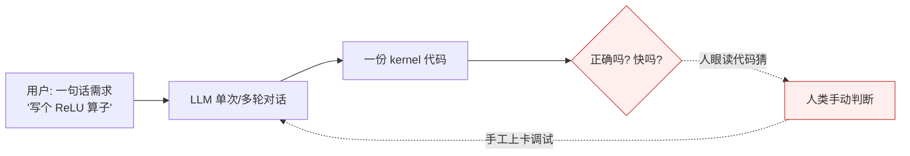
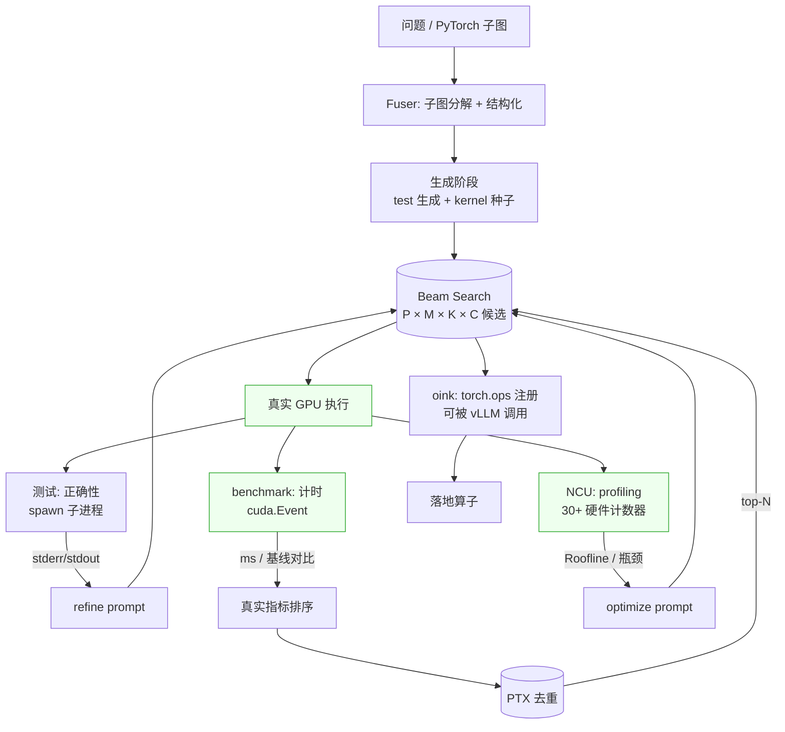
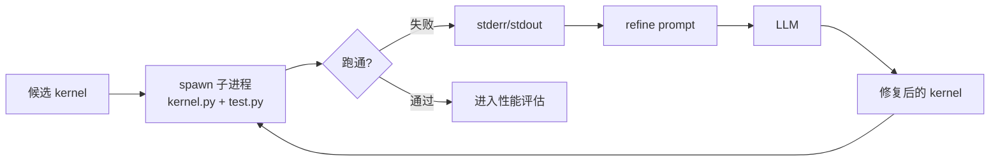
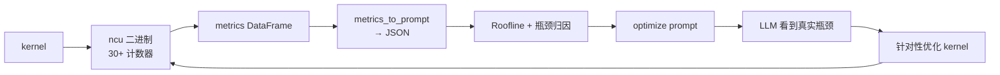
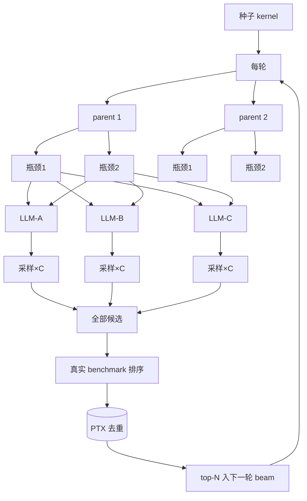
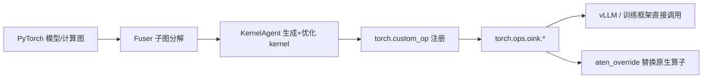

# KernelAgent 为何能比"直接用 LLM / 通用 agent"写出更好的 GPU 算子

> 本文回答一个问题：在"用大模型生成 GPU 算子（Triton kernel）"这件事上，KernelAgent 相对于"直接把需求丢给 LLM"或"用 Claude Code 这类通用 coding agent"到底强在哪。所有论断均落到本仓库的代码证据（`file:line`），不靠泛泛而谈。
> 写于 2026-07-23，基于 `upgrade/switch_llm` 分支（`ae93f59`）。
> 配套实测见 `docs/安装与环境交接.md` 第六节"实施结果"。

---

## 一、核心命题

写一个"能跑、正确、且快"的 GPU 算子，难度不在"把代码写出来"，而在三件**LLM 单次推理做不到**的事：

1. **正确性要靠真实 GPU 执行验证**——kernel 能不能编译、数值对不对，必须上卡跑，LLM 无法靠"读代码"确信。
2. **性能要靠真实计时 + profiling 判定**——哪个 kernel 更快、瓶颈是访存还是算力，必须上卡测，LLM 无法靠"想象"判断。
3. **最优解要靠搜索而非一次生成**——kernel 实现空间巨大，一次生成的"首答"几乎不可能是最优，需要多候选 + 真实反馈迭代。

通用 LLM / 通用 agent 的根本局限是：**它们和 GPU 之间没有闭环**——没有"生成→上卡跑→拿真实指标→反馈→再生成"的执行通道。Claude Code 能读写文件、能跑命令，但它不会替你跑 NCU profiling、不会把 `smsp__warp_issue_stalled_memory_dependency` 这种硬件计数器结构化进下一轮 prompt、更不会把生成的 kernel 注册回 `torch.ops` 供 vLLM 调用。

KernelAgent 的本质，就是**在 LLM 和 GPU 之间架了一条"真实数据闭环"**，并在这条闭环上做搜索。

---

## 二、通用 LLM / 通用 agent 的流程（对比基线）

问题在虚线那两步：**正确性和性能的判定靠人**，反馈靠人手动复述。LLM 拿不到 GPU 的任何客观数据，只能基于代码文本"推理"——这对"写一个 ReLU"够用，对"把 RMSNorm 优化到 Roofline 的 90%"远远不够。

---

## 三、KernelAgent 的核心机制总览

绿色三块（Exec / T / B / NCU）是**通用 agent 完全没有**的"真实 GPU 数据闭环"。下文逐个展开。

---

## 四、六个差异化维度（逐一论证）

### 维度 1：真实 GPU 执行闭环——正确性由"上卡跑"判定，而非 LLM 自评

**通用 agent**：生成代码后，除非人手动跑，否则不知道能不能编译、数值对不对。

**KernelAgent**：每个候选 kernel 都在隔离子进程里真跑 test，拿到 `stdout/stderr/exit code`，失败信息**直接喂回下一轮 prompt** 让 LLM 修。

- 测试执行：`triton_kernel_agent/worker_util.py` 的 `_run_test_multiprocess`（交接文档明确标注为本地 spawn 子进程）。本仓库实测：`generate_kernel("ReLU")` 跑出的 `round_1.json` 里就含 `kernel_code / stdout / stderr / success`——客观执行结果被结构化记录。
- 错误反馈进 prompt：`triton_kernel_agent/prompt_manager.py:199-239` 的 `render_kernel_refinement_prompt`，把 `error_info`（含 stderr）+ 当前 `kernel_code` + `test_code` + `history_context` 一起渲染进 refine prompt。
- 模板见 `triton_kernel_agent/templates/kernel_refinement.j2`。

**为何更强**：LLM 修 bug 不靠"猜哪里错了"，而靠**真实的编译器/运行时错误原文**。通用 agent 即便能跑命令，也不会自动把这个闭环接进生成-迭代循环。

---

### 维度 2：NCU profiling 闭环——把真实硬件瓶颈结构化喂给 LLM（杀手锏）

这是 KernelAgent 最核心的差异化。通用 agent 对"为什么这个 kernel 慢"毫无客观数据；KernelAgent 用 NVIDIA Nsight Compute 采集 **30+ 个真实硬件计数器**，转成 JSON 塞进优化 prompt。

- 采集的指标（`kernel_perf_agent/kernel_opt/profiler/ncu_profiler.py:41-74`，受 CudaForge 启发），包括：
  - 占用率：`sm__warps_active.avg.pct_of_peak_sustained_active`、`launch__occupancy_limit_*`
  - 访存：`dram__throughput.avg.pct_of_peak_sustained_elapsed`、`l1tex__throughput`、`lts__throughput`、`smsp__sass_average_data_bytes_per_sector_mem_global_op_ld.pct`
  - 算力：`sm__inst_executed_pipe_tensor.avg.pct_of_peak_sustained_active`、`sm__pipe_tensor_cycles_active`
  - **停顿归因**：`smsp__warp_issue_stalled_memory_dependency_per_warp_active.pct`（访存停顿）、`..._short_scoreboard`、`..._long_scoreboard`、`..._barrier`、`..._branch_resolving`
- 指标 → prompt：`ncu_profiler.py:404` 的 `metrics_to_prompt`，把 NCU 的 DataFrame 转成 `{kernel_name: {metric: value}}` 的 JSON 供 LLM 消费。
- 这些指标进 prompt 后的形态见 `templates/kernel_optimization.j2` 的 "ROOFLINE ANALYSIS / BOTTLENECK ANALYSIS" 段（`prompt_manager.py:241-306` 的 `render_kernel_optimization_prompt` 渲染）：`Compute SOL %` / `Memory SOL %` / `headroom %` / `bottleneck category` / `root_cause` + `evidence[metric=value]` / `recommended_fix`。

**为何更强**：LLM 不再靠"我觉得这里访存效率低"瞎猜，而是被告知"`smsp__warp_issue_stalled_memory_dependency = 47%`，瓶颈是全局访存停顿，建议用向量化 load / 提升 coalescing"。**真实硬件计数器驱动** vs **LLM 主观想象**，这是质的差别。

> 注：本机无 GPU，NCU 这层当前跑不了（需远程 GPU，见 `安装与环境交接.md` 第四节）。但代码闭环完整存在，这是"架构就绪、待执行环境"。

---

### 维度 3：搜索而非一次生成——beam search 多维 fan-out + PTX 去重

**通用 agent**：线性对话，一次生成一个 kernel，"首答"即终答。

**KernelAgent**：beam search 每轮在多维度展开候选，用真实 benchmark 选 top-N 继续扩展。

- 搜索策略主体：`triton_kernel_agent/opt_worker_component/searching/strategy/beam_search.py`。docstring 明确：
  > Workers per round = **P × M × K × C**
  > - `num_top_kernels` (N)：beam 宽度
  > - `num_expanding_parents` (P)：每轮扩展几个
  > - `num_bottlenecks` (M)：每个父节点探索几个瓶颈方向
  > - `models` (K)：**多 LLM 路由**，每个 LLM 独立做瓶颈分析 + 重写
  > - `samples_per_prompt` (C)：同一 (parent, bottleneck, model) 的独立采样
  > After workers return, candidates are **deduplicated by PTX fingerprint** (same normalized compiled PTX ⇒ same kernel)

- 历史持久化：`opt_manager.py` 用 `ProgramEntry / ProgramMetrics / JSONProgramDatabase`（`opt_worker_component/searching/history/`）把每个候选 kernel + 指标存进 DB，跨轮排序、去重、回溯。
- 多 LLM 路由示例：`examples/configs/beam_search_diverse.yaml` 的 `models: [claude-opus-4.6, gpt-5-4, gemini-2-5-pro]`——不同模型的"思路"并发探索，取长补短。
- 策略多样：`examples/configs/` 下 `beam_search` / `beam_search_diverse`（多样性）/ `beam_search_diverse_concentrated`（聚焦领导者）/ `greedy`（单线）等。

**PTX 去重为何关键**：两个"源码不同"的 kernel（变量名/顺序/写法不同）编译后可能是**完全相同的 PTX**。PTX 指纹去重能识别"表面不同、实质等价"的候选，避免 beam 重复探索同一实现——这是源码 hash 去重做不到的。

- 精确实现：`triton_kernel_agent/opt_worker_component/searching/ptx_fingerprint.py`（`ptx_hash_from_cache` + `normalize_ptx`），从 Triton 编译缓存目录取 PTX、做规范化（剥注释/debug/头、规范寄存器与标号名）再 hash。模块 docstring 直白点出等价关系：*"对变量重命名、注释、空白及大多数源码层 cosmetic 变化不变"*。`ProgramEntry.ptx_hash`（`history/models.py:48`）存这个指纹，benchmark 时采集（`benchmarking/benchmark.py:195`），beam 选枝时按它去重。
- **两套独立去重**：Fuser 侧另有源码级去重 `Fuser/dedup.py` 的 `register_digest`（按 `sha256` 在共享 `shared_digests_dir` 原子登记，区分 `duplicate_same_worker` / `duplicate_cross_worker`）——这是子图阶段的源码去重；Triton agent 侧才是 PTX 去重。两者层级不同、互补。

**为何更强**：一次生成 vs **指数级搜索空间 × 真实指标剪枝 × 两层去重**。LLM 的"首答"质量天花板被搜索 + 去重抬高了。

---

### 维度 4：真实计时选 winner——客观数据，而非 LLM 自评

**通用 agent**："我觉得这个版本更快"——没有数据。

**KernelAgent**：用 CUDA event 真实计时，和 PyTorch Eager 基线对比，用毫秒数选 winner。

- 计时实现：`triton_kernel_agent/opt_worker_component/benchmarking/timing.py:314-325`，`torch.cuda.Event(enable_timing=True)` + `start_event.record()` / `end_event.record()` / `elapsed_time`，受 KernelBench 启发。`benchmark_warmup` / `benchmark_repeat` 控制预热与重复（见 `examples/configs/*.yaml`）。
- 基线对比进 prompt：`kernel_optimization.j2` 的 "PERFORMANCE TARGET" 段——`PyTorch Eager baseline: X ms` / `Current best: Y ms` / `Target: 改进至少 10% (< Y*0.9 ms)`。LLM 看到的是**真实数字目标**，不是模糊的"优化一下"。

**为何更强**：winner 由**真实 GPU 计时**裁定，不是 LLM 的自我评价，也不是人眼。这是性能优化的"ground truth"。

---

### 维度 5：领域 prompt 工程 + reflexion 经验积累

**通用 agent**：泛化系统 prompt，对 Triton/GPU 硬件无专门知识。

**KernelAgent**：为 Triton kernel 精心设计的 Jinja 模板体系 + 跨轮经验沉淀。

- 模板体系（`triton_kernel_agent/templates/`）：`test_generation` / `kernel_generation` / `kernel_refinement` / `kernel_optimization` / `triton_guidelines` / `reflexion_prompt`。
- 领域知识浓缩：`triton_guidelines.j2`（391 行）——kernel 结构、memory access 模式、indexing/grid、优化技巧（autotune / BLOCK_SIZE / tensor cores / warp specialization / epilogue subtiling / 算子融合）、常见 pattern（elementwise/reduction/matmul/softmax/fused BN/LayerNorm）、高级特性（persistent kernel / TMA / multi-stage / warp specialize）、**运行时硬约束**（wrapper 只做校验分配启动，所有计算在 Triton kernel 内，禁止 `torch.nn`/`torch.matmul`/`torch.ops.aten.*`），并附**真实 kernel 示例**。这套知识相当于把"资深 Triton 工程师的经验"固化进 prompt。
- GPU 硬件感知：`kernel_optimization.j2` 顶部直接列 TARGET GPU 规格（SM 数 / 每 SM 线程数 / L1/L2 / 峰值 FP32/FP16/BF16 TFLOPS / 峰值显存带宽），来源 `kernel_perf_agent/kernel_opt/diagnose_prompt/gpu_specs.py`。LLM 写 kernel 时就知道目标卡的参数。
- **reflexion 经验积累**（`prompt_manager.py:308-358`）：每次优化尝试后让 LLM 自我反思（`was_diagnosis_correct` / `was_fix_effective` / `lessons` / `avoid_patterns` / `try_patterns`），这些反思跨轮累积，在下轮 prompt 里以 "AVOID: ... / PRIORITIZE: ..." 注入。单次 LLM 调用没有"经验"，这里有了。

**为何更强**：领域知识固化 + 经验跨轮累积。通用 agent 每次"从零开始想"，KernelAgent 越试越懂这个具体问题。

---

### 维度 6：Fuser 子图分解 + torch.ops 算子注册——端到端闭环

**通用 agent**：给你一段 kernel 代码，怎么集成进你的模型、怎么替换原生算子——你自己想办法。

**KernelAgent**：两端都打通。

- **前端结构化（Fuser）**：`Fuser/subgraph_extractor.py` 从 PyTorch 计算图提取可融合子图；`Fuser/prompting.py` 的 `BASE_DEVELOPER_PROMPT` 让 LLM 把模型重写为"每个融合子图是独立 `nn.Module` + 显式 input/output shape 契约"，含 attention 整块融合指导、`run_tests()` 数值等价校验、`error_context` 反馈循环、4 个 wording variant 增多样性。这是把"一段描述"变成"结构化、可校验的子任务"。
- **problem 的结构化定义**：`examples/optimize_02_rmsnorm/problem.py` 不是"一句话描述"，而是一个可执行的 `nn.Module`（`forward` 给出语义）+ `get_inputs()`（**固定 shape**：`batch_size=112, features=64, dim1=512, dim2=512`）+ `get_init_inputs()`。LLM 拿到的是"有明确 shape/dtype、有参考实现、可直接跑"的结构化问题，而非模糊的自然语言需求。
- **后端落地（oink）**：`oink/src/kernelagent_oink/blackwell/oink_custom_ops.py` 用 `@custom_op("oink::rmsnorm")` + `@register_fake` 把生成的 kernel 注册成 `torch.ops.oink.rmsnorm`，**可直接被 vLLM 调用**；`oink/src/kernelagent_oink/aten_override.py` 用 `torch.library.Library("aten","IMPL")` 覆盖 `aten::_fused_rms_norm`——即用生成的 kernel **替换 PyTorch 原生算子**。这就是交接文档第二十二节说的"算子替换机制（torch.library）"。

**为何更强**：从"模型里的一个热点算子"到"可被推理框架直接调用的注册算子"全程闭环。通用 agent 产出的只是"一段代码"。

---

## 五、综合对比

| 维度 | 直接用 LLM / 通用 agent | KernelAgent | 代码证据 |
|---|---|---|---|
| 正确性判定 | 人眼/手动跑 | spawn 子进程真跑 + stderr 回灌 | `worker_util.py` / `kernel_refinement.j2` |
| 性能判定 | LLM 自评/人猜 | CUDA event 真实计时 vs 基线 | `benchmarking/timing.py:314` |
| 瓶颈分析 | 无客观依据 | NCU 30+ 计数器 → Roofline → prompt | `ncu_profiler.py:41,404` |
| 生成策略 | 单次/线性 | beam search P×M×K×C + PTX 去重 | `beam_search.py` / `opt_manager.py` |
| 领域知识 | 泛化 | 391 行 Triton 指南 + GPU 规格 | `triton_guidelines.j2` / `gpu_specs.py` |
| 经验积累 | 无 | reflexion 跨轮 lessons/avoid/try | `prompt_manager.py:308` |
| 问题结构化 | 原始描述 | Fuser 子图分解 + shape 契约 | `Fuser/subgraph_extractor.py` |
| 落地集成 | 给一段代码 | torch.ops 注册 + aten 覆盖 | `oink_custom_ops.py` / `aten_override.py` |

---

## 六、一句话总结

> 通用 LLM/agent 和 GPU 之间是**开环**——它生成代码，但拿不到 GPU 的任何回执，正确性和性能全靠人。
> KernelAgent 在 LLM 和 GPU 之间架了**真实数据闭环**（执行 → 计时 → profiling → 反馈），并在这条闭环上做 **beam search**：用真实硬件指标剪枝、用 PTX 指纹去重、用 reflexion 积累经验，最后把 kernel 注册回 `torch.ops` 落地。
> **LLM 负责"生成候选"，GPU 负责"判真假判快慢"，搜索负责"找到最优"**——三者各司其职，这是 KernelAgent 比单靠 LLM 强的根本原因。

---

## 七、适用边界（诚实说明）

KernelAgent 不是万能：

- **必须要有 GPU**：执行/计时/profiling 三件套全靠真实 GPU。本机无 GPU 时，只能验证到"LLM 生成阶段"（见 `安装与环境交接.md` 实施结果），后面要走远程 daemon 改造（第四节）。
- **依赖 NCU 可用**：NCU 需权限（`KERNELAGENT_NCU_USE_SUDO`），且 `ncu` 路径可能要按机器调整（交接文档第四节"坑"）。
- **生成质量仍受限于底座模型**：接入国产模型（如 deepseek-v4-pro）后，复杂 kernel 的生成质量仍取决于模型本身；KernelAgent 提供"闭环和搜索"，不改变"底座能力上限"。
- **简单算子差异不大**：对"写个 elementwise ReLU"这种，通用 agent 也够用；KernelAgent 的优势在**复杂、需要 profiling 驱动优化**的算子上才显著拉开。
- **成本与延迟**：多轮迭代 + 每轮多 worker + profiling，单算子生成时间远高于一次 LLM 调用。

一句话：**越是"需要真实 GPU 反馈才知道好不好"的算子，KernelAgent 相对通用 agent 的优势越大。**
